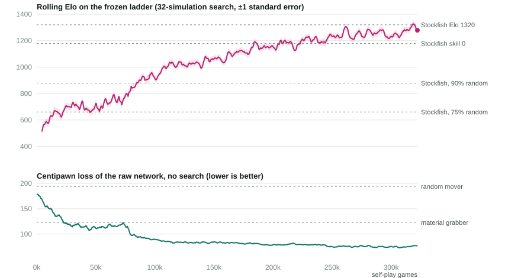

# alpha-fly

**A fruit fly's brain, taught chess by playing itself.**
Play it in your browser: **https://turlockmike.github.io/alpha-fly/**

In 2026 the [MaleCNS](https://www.janelia.org/project-team/flyem) project (HHMI Janelia, Google Research and
Cambridge) published the complete wiring diagram of a male fruit fly's central nervous system: 166,700 neurons,
10.5 million connections, and whether each one excites or inhibits. This repository takes that diagram, changes
nothing about it, and trains it to play chess the AlphaZero way: no human games, no engine hints, only games
against itself.

After 322,016 games and 23 hours on one consumer GPU, the fly holds its own against Stockfish at its weakest
calibrated level (UCI Elo 1320). Without any search at all, its first instinct is roughly a 1200-rated human.



## What is actually the fly's

Everything about *who talks to whom*. Every neuron, every synapse, its direction and its sign (excitatory or
inhibitory, from the predicted neurotransmitter) is exactly as in the connectome. The board is fed to the fly's
17,937 sensory neurons, activity ripples through the wiring for six update steps, and the move and the
evaluation are read off its 2,333 motor and descending neurons.

```
board (838 features, from the side to move's view)
  └─ one linear map ─► 17,937 sensory neurons
                          │  six steps of  h ← h + α·(clamp(W h + b + input, 0, 10) − h)
                          │  through the fixed wiring W  (166,700 neurons, 10.5M synapses)
                          ▼
                       2,333 output neurons (efferent + descending)
  ├─ one linear map ─► 4,168 move logits
  └─ one linear map ─► win / draw / loss
```

What training changed: one gain per synapse (how loud it is; it can't change sign or partner), a resting level
and a time constant per neuron, and the linear maps in and out. The maps are single linear layers, so all the
nonlinear chess computation happens inside the connectome.

## How it learned

Plain AlphaZero self-play, scaled down to one GPU:

1. Play 1,120 games at once against yourself, choosing each move with a small tree search (32 simulations,
   [Gumbel AlphaZero](https://openreview.net/forum?id=bERaNdoegnO) style).
2. Train the network to predict which moves the search preferred and who ended up winning.
3. Repeat. Every 65 seconds or so, 256 more games land in the replay buffer.

Stockfish appears in this project only as a ruler. It plays rating games against the fly and scores a fixed
suite of positions so the chart can show centipawn loss, but nothing it produces ever reaches the training data.

The milestones, measured against a frozen ladder of opponents:

| Games | GPU hours | Reached |
| --- | --- | --- |
| 53,000 | 5 | Beats Stockfish playing 75% random moves |
| 83,000 | 9 | Beats Stockfish playing 90% random moves |
| 181,000 | 15 | Parity with Stockfish skill level 0 |
| 322,000 | 23 | Parity with Stockfish UCI Elo 1320, held over three consecutive 200-game windows |

## Things we learned along the way

Some of these cost a day each. They are all written into the code as comments next to the setting they concern.

* **The loss function is the boss.** For a while, games that hit the move limit were adjudicated on material.
  The fly learned that sitting on a material lead *is* winning: checkmates fell from half of its games to a third
  and its rating stopped moving for 160 iterations. Turning adjudication off ended the plateau within hours.
* **The signal is 1% of the noise.** A neuron's position-dependent activity is about a hundredth of its resting
  activity. Half-precision arithmetic silently rounded it away, and for 290 iterations self-play ran on a
  corrupted copy of the network (its best moves agreed with full precision only 60% of the time). The fix carries
  only the *deviation* from the resting trajectory in half precision.
* **Depth matters.** With four update steps, signals from the eyes reach the outputs but only 23% of synapses
  can carry position information along the way; with six, 92% can. Four-step training stalled around Elo 450.
* **Openings need variety.** With a peaked policy, 1.d4 was answered by ...d5 in 43 of 44 games. Starting each
  game with a few random plies (KataGo's trick) was worth about 30 Elo.
* **Search is worth a lot to this network.** The same weights score 34%, 52% and 62% against Stockfish skill 0
  at 32, 128 and 400 simulations per move. The site's "Deepest" setting is a genuinely different opponent.
* **Is the fly's wiring special?** Probably not for chess. A control with the same neurons, degrees and signs
  but random partners learned at least as fast over its first 39,000 games (it was run to 12% of the fly's
  budget; the log is in `results/`). What seems to matter is the scale and sparsity of the substrate, not who
  evolution wired to whom.

The engineering detail (what is logged, how strength is measured, what each iteration costs, what differs from
AlphaZero and why) is in [TRAINING.md](TRAINING.md).

## Play it locally, train it yourself

The site in `docs/` is static: the trained network (101 MB) is downloaded once and evaluated in your browser, on
your graphics card through WebGPU where available, otherwise on the CPU (a 32-simulation move takes a few
seconds). To serve it locally: `python -m http.server -d docs 8090`.

Training needs Python 3.12, [uv](https://docs.astral.sh/uv/), an NVIDIA GPU and, for the ratings,
[Stockfish](https://stockfishchess.org/) at `tools/stockfish.exe` (or `$STOCKFISH`).

```
uv sync --extra dev
uv run pytest                                              # kernels vs dense, encoding, search, workers, pause/resume
uv run python -m chessfly.train --run fly --steps 6 --gumbel --lazy --sample_reuse 1      # downloads MaleCNS on first use
uv run python -m chessfly.dashboard                        # live charts and a play page on http://127.0.0.1:8765
uv run python -m chessfly.train --run shuffled --steps 6 --gumbel --lazy --sample_reuse 1 --shuffled    # the control
uv run python scripts/export_web.py runs/fly/last.pt docs/model                          # your own network into the site
```

Every dataclass field in `model.py`, `mcts.py`, `selfplay.py` and `train.py` is a command-line flag. Ctrl+C pauses
cleanly; the same command resumes. `python -m chessfly.uci <checkpoint>` is a UCI engine for any chess GUI. The
trained checkpoint is on the [releases page](https://github.com/turlockmike/alpha-fly/releases).

## Layout

```
chessfly/connectome.py   MaleCNS download and parsing; the shuffled control
chessfly/brain.py        the connectome as a sparse recurrent network (cuSPARSE, exact light-cone evaluation)
chessfly/model.py        encoder, connectome, read-out, heads
chessfly/encoding.py     board -> features, move <-> policy index
chessfly/mcts.py         Gumbel AlphaZero / PUCT search, batched across games
chessfly/selfplay.py     game pool, random openings, TD(λ) targets
chessfly/workers.py      search worker processes and the continuous rating arena
chessfly/train.py        the training loop, logging, pause / resume
chessfly/ladder.py       Stockfish opponents and Elo fitting
chessfly/dashboard.py    live dashboard and a local play page
docs/                    the website: fly.js (the network and search in JavaScript), the exported weights
scripts/                 export, benchmarks, probes, A/B comparison tools
results/                 training logs of the main run and the control
```

## Credits

The connectome is MaleCNS v1.0 by HHMI Janelia's FlyEM team, Google Research and the University of Cambridge.
Chess pieces by Colin M.L. Burnett (BSD). Move generation in the browser by [chess.js](https://github.com/jhlywa/chess.js).
Built with [Claude Code](https://claude.com/claude-code). MIT licence.
